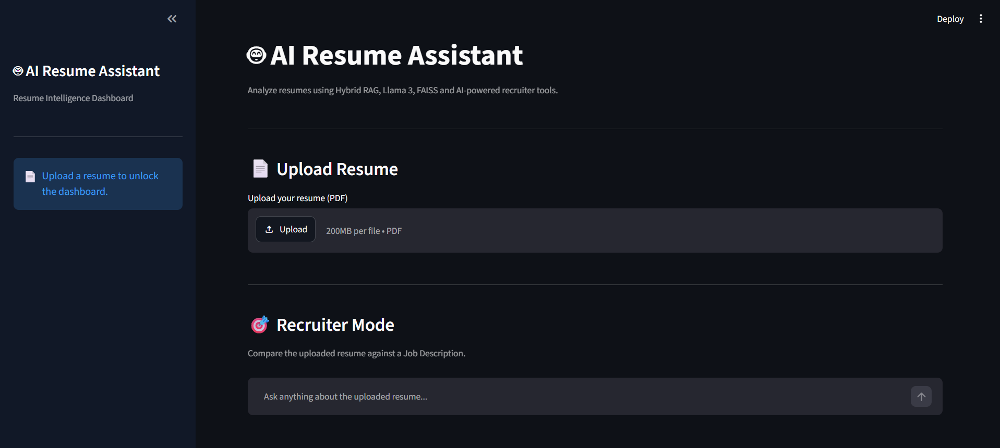
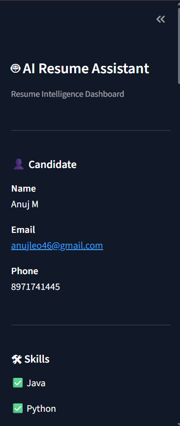

# 🤖 AI Resume Assistant

An AI-powered Resume Assistant built using **FastAPI**, **Streamlit**, **Llama 3**, **LangChain**, and **FAISS**. Upload a resume, chat with it using natural language, analyze ATS compatibility, compare it with job descriptions, and receive AI-powered resume feedback.

---

## 🚀 Features

### 📄 Resume Upload
- Upload resumes in PDF format
- Automatically extracts text from the resume
- Splits the resume into semantic sections
- Stores embeddings using FAISS for fast retrieval

### 💬 AI Resume Chat
- Ask questions about the uploaded resume
- Uses Retrieval-Augmented Generation (RAG)
- Maintains conversation history for contextual answers
- Displays source sections used to generate responses

Example Questions:
- What are my technical skills?
- Tell me about my projects.
- What experience do I have?
- Which programming languages do I know?
- Summarize my resume.

---

### 📊 Resume Dashboard

Automatically extracts:

- 👤 Candidate Information
- 📧 Email
- 📱 Phone Number
- 🛠 Technical Skills
- 💼 Experience
- 🚀 Projects
- 🎓 Education

---

### 🎯 Recruiter Mode

Compare your resume with any Job Description.

Outputs:

- ✅ Match Score
- ✅ Matching Skills
- ❌ Missing Skills
- 💡 AI Recommendation

Perfect for tailoring resumes before applying.

---

### 📈 ATS Resume Score

Automatically evaluates the resume on multiple factors:

- Resume completeness
- Technical skills
- Projects
- Experience
- Education
- Contact information

Provides:

- ATS Score (0–100)
- Resume Strengths
- Improvement Suggestions
- Final Verdict

---

### 📝 AI Resume Review

Uses Llama 3 to generate professional feedback including:

- Resume strengths
- Weak sections
- Missing content
- Writing quality
- Suggestions to improve recruiter impact

---

## 🛠 Tech Stack

### Backend
- FastAPI
- LangChain
- FAISS
- HuggingFace Embeddings
- Ollama
- Llama 3

### Frontend
- Streamlit

### AI & NLP
- Retrieval-Augmented Generation (RAG)
- Semantic Search
- Sentence Transformers
- Hybrid Retrieval

### Other Libraries
- PyPDF
- Requests
- Pydantic

---

## 📂 Project Structure

```
AI-Resume-Assistant
│
├── app
│   ├── services
│   │   ├── chat_services.py
│   │   ├── chunk_service.py
│   │   ├── conversation.py
│   │   ├── job_match_service.py
│   │   ├── ats_service.py
│   │   ├── pdf_service.py
│   │   ├── resume_review.py
│   │   ├── resume_summary.py
│   │   ├── retriever_service.py
│   │   └── vector_store.py
│   │
│   ├── uploads
│   └── main.py
│
├── frontend.py
├── requirements.txt
├── README.md
└── .gitignore
```

---

## ⚙️ Installation

### Clone Repository

```bash
git clone https://github.com/anuj1102001/AI-Resume-Assistant.git

cd AI-Resume-Assistant
```

---

### Create Virtual Environment

Windows

```bash
python -m venv .venv

.venv\Scripts\activate
```

Mac/Linux

```bash
python3 -m venv .venv

source .venv/bin/activate
```

---

### Install Dependencies

```bash
pip install -r requirements.txt
```

---

### Install Ollama

Download:

https://ollama.com/download

Pull Llama 3 model

```bash
ollama pull llama3
```

Start Ollama

```bash
ollama serve
```

---

### Run Backend

```bash
uvicorn app.main:app --reload
```

Backend runs at

```
http://127.0.0.1:8000
```

---

### Run Frontend

```bash
streamlit run frontend.py
```

Frontend runs at

```
http://localhost:8501
```

---

## 📌 API Endpoints

| Method | Endpoint | Description |
|----------|-----------|---------------------------|
| GET | / | Health Check |
| POST | /upload | Upload Resume |
| POST | /ask | Chat with Resume |
| GET | /resume-summary | Resume Dashboard |
| POST | /job-match | Recruiter Mode |
| GET | /ats-score | ATS Analysis |
| GET | /resume-review | AI Resume Review |
| POST | /clear-chat | Clear Conversation |

---

## 🧠 AI Workflow

```
PDF Resume
      │
      ▼
Extract Text
      │
      ▼
Split into Chunks
      │
      ▼
Generate Embeddings
      │
      ▼
Store in FAISS
      │
      ▼
User Question
      │
      ▼
Retrieve Relevant Chunks
      │
      ▼
Llama 3
      │
      ▼
Final AI Response
```

---

## 📸 Screenshots

### Home Page



---

### Resume Dashboard



---

### Recruiter Mode

_Add screenshot here_

---

### ATS Score

_Add screenshot here_

---

### AI Resume Review

_Add screenshot here_

---

### Resume Chat

_Add screenshot here_

---

## 🌟 Future Improvements

- Multi Resume Comparison
- Resume Version History
- Cover Letter Generator
- LinkedIn Profile Analyzer
- Resume Keyword Optimizer
- Job Recommendation System
- Voice-based Resume Chat
- Cloud Deployment (AWS/Azure)

---

## 👨‍💻 Author

**Anuj M**

LinkedIn: https://www.linkedin.com/in/anuj1102001/

GitHub: https://github.com/anuj1102001

---

## ⭐ If you found this project useful

Please consider giving it a ⭐ on GitHub!
